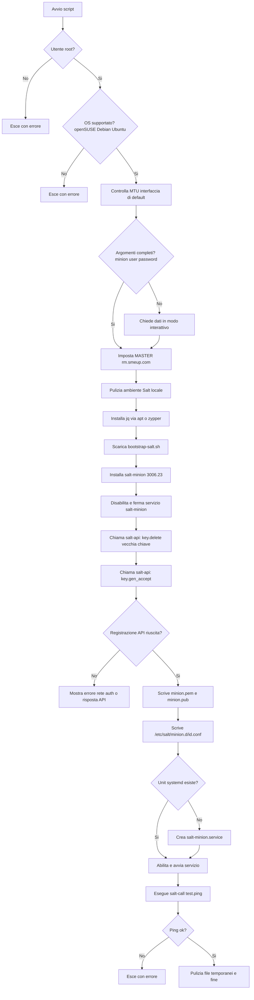
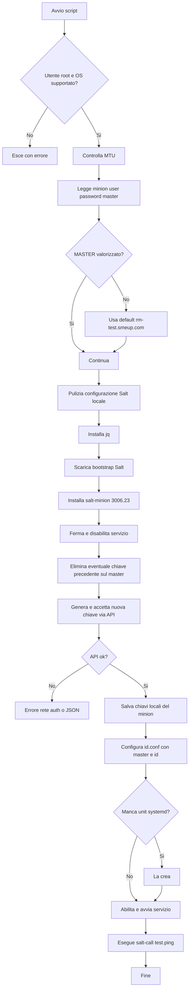
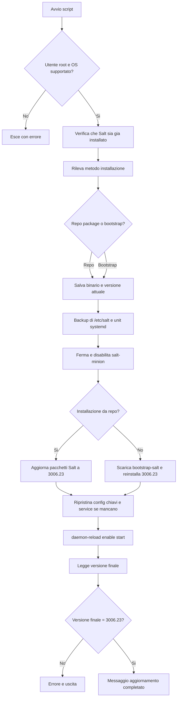
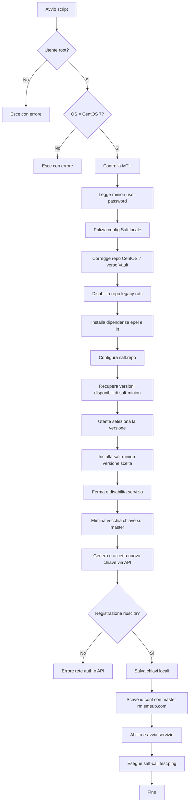
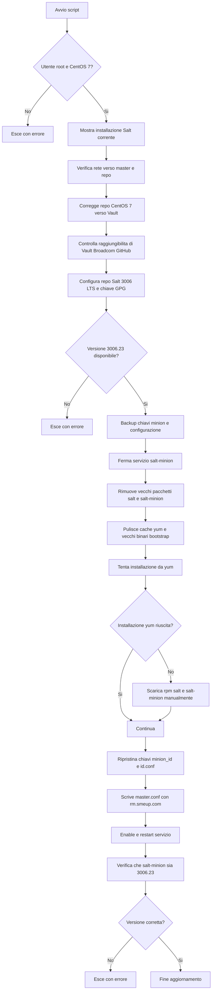
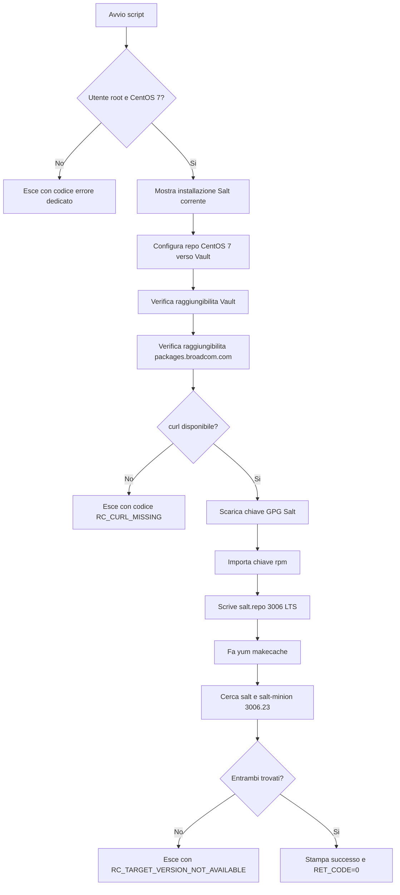
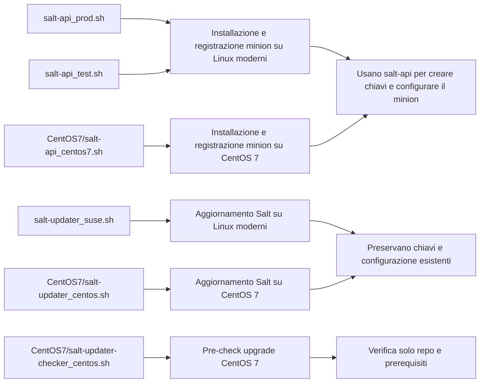

# Script Flowcharts

Questo file riassume, con diagrammi Mermaid, cosa fa ogni script della repo.

## Mappa veloce

| Script | Scopo |
|---|---|
| `salt-api_prod.sh` | Registra e installa un minion Salt su openSUSE/Debian/Ubuntu verso `rm.smeup.com` |
| `salt-api_test.sh` | Registra e installa un minion Salt su openSUSE/Debian/Ubuntu verso un master test scelto o predefinito |
| `salt-updater_suse.sh` | Aggiorna Salt su openSUSE/Debian/Ubuntu alla `3006.23` preservando configurazione e chiavi |
| `CentOS7/salt-api_centos7.sh` | Registra e installa un minion Salt su CentOS 7, con scelta interattiva della versione |
| `CentOS7/salt-updater_centos.sh` | Aggiorna Salt su CentOS 7 alla `3006.23` usando repo Broadcom/Vault e ripristinando chiavi |
| `CentOS7/salt-updater-checker_centos.sh` | Non aggiorna nulla: verifica solo che CentOS 7 e i repository permettano l'upgrade target |

## 1. `salt-api_prod.sh`

## 2. `salt-api_test.sh`

Differenza principale rispetto al `prod`: qui il master non è fisso, può essere passato come quarto argomento oppure inserito a mano, con default `rm-test.smeup.com`.

## 3. `salt-updater_suse.sh`

Dettaglio importante:

- Se trova un'installazione da repository usa `apt-get` o `zypper`.
- Su SUSE può aggiungere/abilitare il repo Broadcom `salt-repo-lts`.
- Se trova un'installazione bootstrap, reinstalla via `bootstrap-salt.sh`.

## 4. `CentOS7/salt-api_centos7.sh`

Questo script è quello più “manuale” lato installazione: prima sistema i repository di CentOS 7, poi ti fa scegliere interattivamente quale versione di `salt-minion` installare.

## 5. `CentOS7/salt-updater_centos.sh`

Questo è lo script di upgrade vero per CentOS 7.

## 6. `CentOS7/salt-updater-checker_centos.sh`

Questo script serve come “pre-check”: verifica in anticipo se un host CentOS 7 è pronto per l'aggiornamento, senza rimuovere o installare nulla.

## Relazioni tra gli script

